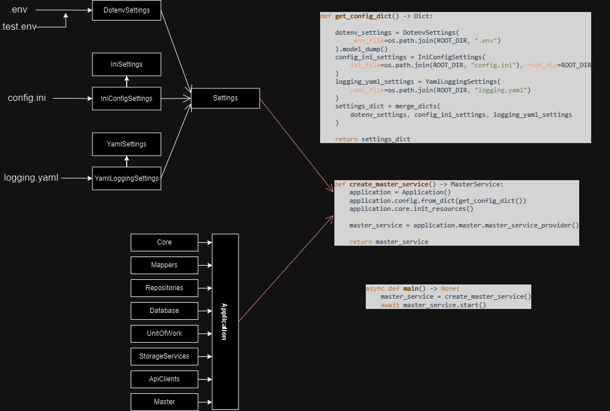
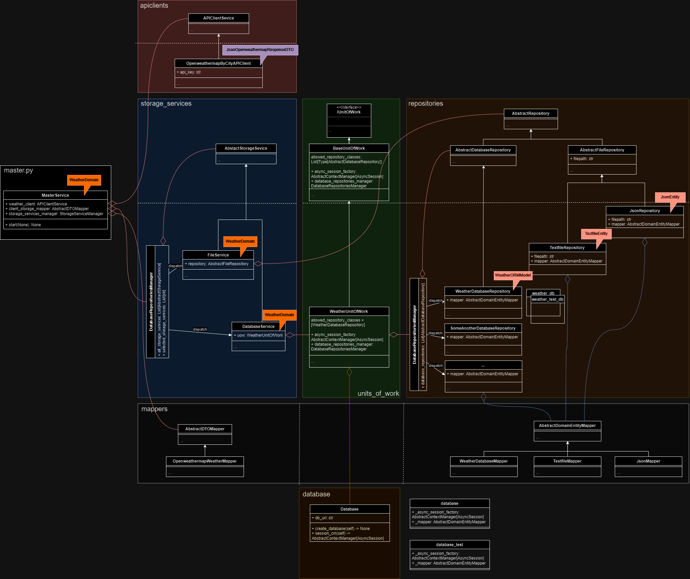
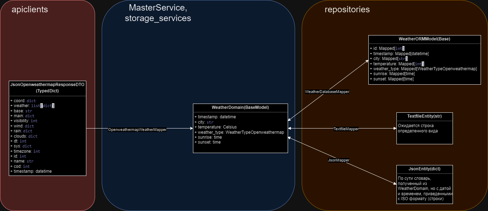

# Weather Collector


Проект Weather Collector представляет собой демонстратор архитектуры веб-приложения, разработанный с использованием принципов SOLID, слоистой архитектуры и других паттернов проектирования. В рамках приложения также использован DI-контейнер с применением фреймворка dependency-injector.


### Функции приложения


1. Получение списка 20 крупнейших городов по численности населения (по умолчанию хранится в top_cities.py).
2. Получение данных о погоде для указанных городов.
3. Преобразование и сохранение данных в различных хранилищах (на выбор ["db", "json", "text"]):
    - в базе данных (обозначение "db")
    - текстовом файле (обозначение "text")
    - в json-файле (обозначение "json")


### Конфигурация и запуск приложения

DI-контейнер `Application` (src.di_container.Application) выстраивает дерево зависимостей, используемых в приложении.
Приложение конфигурируется на основе файлов: .env и .test.env, config.ini, logging.yaml. Файл .env и .test.env читаются
Pydantic-моделью `DotenvSettings` (src.configurations.dotenv_file.DotenvSettings). Во время тестирования приложения плагин pytest-dotenv подменяет значения общих переменных файлов .env и .test.env значениями из .test.env.
Файл config.ini читается объектом класса `IniConfigSettings` (src.configurations.ini_file.IniCoonfigSettings).
Файл конфигурации логгеров logging.yaml читается объектом класса `YamlLoggingSettings` (src.configurations.yaml_file.YamlLoggingSettings).
После того, как файлы прочитаны и помещены в соответствующие структуры, они приводятся к словарям и объединяются в общий словарь с помощью функции
`merge_dicts` (src.configurations.merged_config.merge_dicts).

В функции `create_master_service` (src.main.create_master_service) создается экземпляр контейнера,
в функции `get_config_dict` (src.main.get_config_dict) создается структура с настройками, которая затем прошивается в экземпляр контейнера. Функция возвращает экземпляр мастер-сервиса, ответственного за поток выполнени программы.

В функции main происходит вызов функции `create_master_service`, который создает экземпляр мастер-сервиса.
Экземпляр вызывает метод `start`, который запускает поток выполнения программы.

Наглядно процесс конфигурации и запуска приложения представлен на рисунке ниже:



В файле .env содержится:
  - Секретный API-ключ для соединения со сторонним сервисом
  - Параметры подключения к базе данных

В файле .test.env содержатся параметры подключения к тестовой базе данных

В файле config.ini содержится:
  - В разделе [storage_services] набор выбранных сервисов для хранения данных (на выбор ["db", "json", "text"])
  - В разделе [repositories] имена директорий, где будут храниться файлы с текстовыми и json данными

В файле logging.yaml содержится конфигурационная информация для логгеров

Конкретные именя переменных, опций и разделов можно найти в файле [environment.txt](https://github.com/semyonnakrokhin/weather_collector/blob/main/environment.txt)

### Общая архитектура приложения

Приложение состоит из четырех функциональных блоков (apiclients, storage_services, repositories, units_of_work),
двух вспомогательных блоков (mappers, database), модуля `master.py` c главным сервисом `MasterService`, ответственным за поток выполнения программы (см. рисунок ниже).



Над каждым классом указана модель данных, с которой данный класс работает.
За преобразование одной модели в другую отвечают мапперы.

### Модели и преобразование моделей

Информация о составе моделей приложения и логике их преобразования представлена на диаграме ниже. В ней также представлены, какие атрибуты входят в каждый объект одного из указанных типов. Белым шрифтом в цветных прямоугольниках указаны области применения данных моделей:



- **`JsonOpenweathermapResponseDTO`** представляет собой модель данных, содержащую информацию о погоде, полученную из OpenWeatherMap API в формате JSON. Является TypedDict.
- **`WeatherDomain`** представляет собой доменную модель данных, предназначенную для хранения информации о погоде. Является pydantic классом.
- **`WeatherORMModel`** представляет собой ОРМ модель SQLAlchemy
- **`TextfileEntity`** содержит рекомандации и шаблон, как оформлять строку для записи в файл. Является строкой
- **`JsonEntity`** содержит незначительные изменения по сравнению с `WeatherDomain`, касательно того, как будет выглядеть формат `datetime` при сериализации


# Запуск в контейнерах Docker
1. Перейдите в директорию с вашими проектами.
2. Склонируйте репозиторий на свой локальный компьютер:

```shell
# Linux
> https://github.com/semyonnakrokhin/weather_collector.git
```

3. Перейдите в каталог проекта:

```shell
# Linux
> cd weather_collector
```

4. В этой директории создайте файлы, перечисленные в [environment.txt](https://github.com/semyonnakrokhin/weather_collector/blob/main/environment.txt)

5. Выполните команду находясь в корневой директории проекта:

```shell
# Linux
> docker-compose up --build
```

6. Для остановки контейнеров выполните команду:

```shell
# Linux
> docker-compose down
```


# Обычная установка и запуск на локальном хосте

1. Перейдите в директорию с вашими проектами.
2. Склонируйте репозиторий на свой локальный компьютер:

```shell
# Windows
> git clone https://github.com/semyonnakrokhin/weather_collector.git
```

3. Перейдите в каталог проекта:

```shell
# Windows
> cd weather_collector
```

4. Создайте виртуальное окружение python. Придумайте ему название, например venv_weather:

```shell
# Windows
> python -m venv venv_weather
```

5. Активируйте виртуальное окружение (не забудьте изменить имя виртуального окружения на свое):

```shell
# Windows
> .\venv_weather\Scripts\activate
```

6. Установите зависимости:

```shell
# Windows
> pip install -r requirements.txt
```

7. Установите PostgreSQL или убедитесь, что PostgreSQL установлен на вашей машине. Вы можете загрузить и установить PostgreSQL с официального веб-сайта.
8. Создайте новую базу данных PostgreSQL для вашего проекта (убедитесь, что процесс postgres запущен).

- Подключитесь к PostgreSQL (при помощи какого либо клиента) используя стандартного суперпользователя и стандартной базы данных
- Создайте базу данных обычную и для тестов (например, weather_db и weather_test_db):

```sql
CREATE DATABASE weather_db;
CREATE DATABASE weather_test_db;
```

- Если желаете, можете создать нового пользователя (например weather_user) и придумать ему пароль (например qwerty), от которого будете ходить в эту бд:

```sql
CREATE USER weather_user WITH PASSWORD 'qwerty';
```

- Дайте новому пользователю все привилегии для работы с базами данных:

```sql
GRANT ALL PRIVILEGES ON DATABASE weather_db TO weather_user;
GRANT ALL PRIVILEGES ON DATABASE weather_test_db TO weather_user;
```

- Дайте новому пользователю доступ к схеме public, сделав его владельцем баз данных:

```sql
ALTER DATABASE weather_db OWNER TO weather_user;
ALTER DATABASE weather_test_db OWNER TO weather_user;
```

9. Создайте в корневом каталоге файлы .env и .test.env и заполните его переменными для доступа к обычной бд и тестовой соответственно по [по шаблону из раздела "Конфигурация и запуск приложения"](#конфигурация-и-запуск-приложения).
Имена переменных не менять, значения вставьте свои:


10. Находясь в корневом каталоге, выполните миграции:

```shell
# Windows
> alembic upgrade head
```

11. Запустите приложение, используя команду:

```shell
# Windows
> python src/main.py
```

12. Для тестирования выполните команду (первую):

```shell
# Windows
> pytest tests
> pytest tests/test_main.py
> pytest -s --pdb tests/tests
(Pdb) q
```

# Вклад
Если вы хотите внести свой вклад в Weather Collector, пожалуйста, ознакомьтесь с CONTRIBUTING.md для получения дополнительной информации о том, как начать.

# Авторы
Семен Накрохин
2206095@gmail.com

# Лицензия
Этот проект распространяется под лицензией MIT. Подробности смотрите в файле LICENSE.
