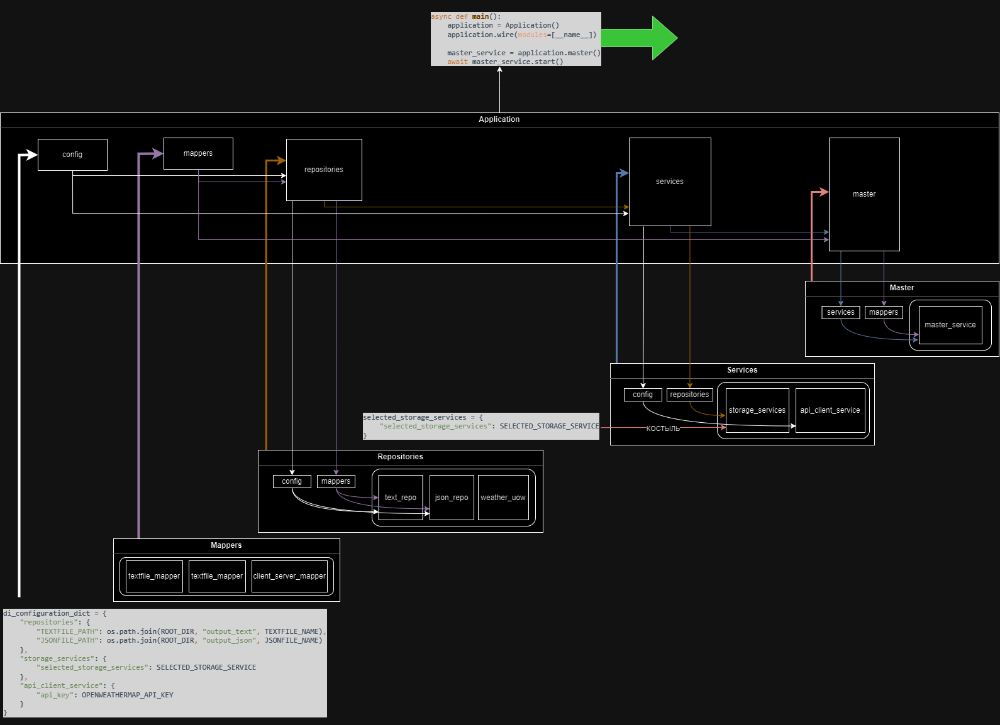
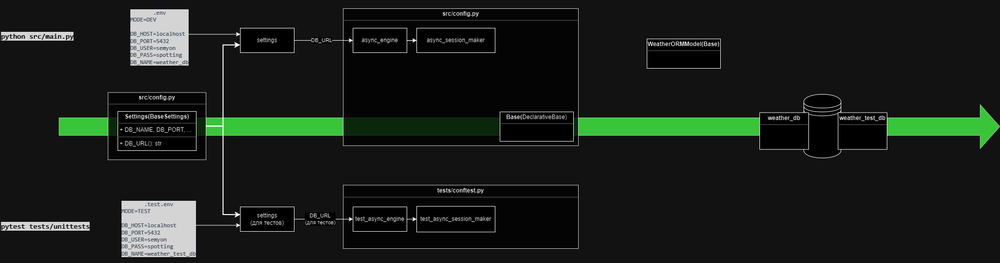

# Weather Collector


Проект Weather Collector представляет собой демонстратор, разработанный с использованием принципов SOLID, YAGNI, слоистой архитектуры и других паттернов проектирования. В рамках приложения также использован DI-контейнер с применением фреймворка dependency-injector.


### Функции приложения


1. **Топ-20 городов**:
    - Список 20 крупнейших городов по численности населения хранится в указанном файле.

2. **Поток выполнения**:
    - Получение данных о погоде для указанных городов.
    - Преобразование и сохранение данных в различных хранилищах.

3. **Конфигурация приложения**:

    - Пользователь устанавливает параметры в конфигурационном файле с раширением `config.py`:
        - Имя текстового файла.
        - Имя JSON-файла.
        - Стратегии хранения данных с использованием сокращенных обозначений (["db", "json", "text"]).

    - Пользователь также указывает API-ключ для сервиса погоды и учетные данные для базы данных в файле .env.
    - Креденшиалсы тестовой базы данных указываются в файле .test.env для безопасного прогона тестов.

config.py
```python
TEXTFILE_NAME = f"meteo_{int(datetime.now().timestamp())}.txt"
JSONFILE_NAME = f"meteo_{int(datetime.now().timestamp())}.json"
SELECTED_STORAGE_SERVICE = ["db", "json", "text"]
```

.env
```plaintext
MODE=DEV

DB_HOST=localhost
DB_PORT=5432
DB_USER=user
DB_PASS=qwerty
DB_NAME=weather_db

OPENWEATHERMAP_API_KEY=some_api_key
```

.test.env
```plaintext
MODE=TEST

DB_HOST=localhost
DB_PORT=5432
DB_USER=user
DB_PASS=qwerty
DB_NAME=weather_test_db

OPENWEATHERMAP_API_KEY=some_api_key
```

4. **Запуск приложения**:
    - После настройки пользователь запускает приложение и наслаждается результатами.

### Общая архитектура приложения

Наглядная информация об архитектуре приложения представлена на UML-диаграме ниже:


Приложение состоит из трех функциональных компонентов (apiclients, storage_services, repositories), одного вспомогательного (mappers) и одного оркестрирующего (master.py):

1. **(Функциональный) Клиент для запросов на сторонний сервис:**
   - **`APIClientService` (Абстрактный сервис взаимодействия с внешними сервисами):**
     - Абстрактный класс `APIClientService` является базовым интерфейсом для клиентов, отправляющих запросы на внешние сервисы.
     - Содержит абстрактный метод `get` для получения данных.

   - **`OpenweathermapByCityAPIClient`:**
     - `OpenweathermapByCityAPIClient` является конкретной реализацией клиента для получения погодных данных от OpenWeatherMap API по названию города.
     - Инициализируется строкой `api_key` типа `str`, представляющего собой ключ доступа к API внешнего сервиса.
     - Данные хранит в объекте `JsonOpenweathermapResponseDTO` (подробнее об этом DTO см. ниже)

2. **(Функциональный) Набор сервисов для сохранения данных, использующий две стратегии хранения: в файл и в базу данных:**
   - **`AbstractStorageService`:**
     - Абстрактный класс `AbstractStorageService` является базовым интерфейсом для сервисов хранения данных.
     - Содержит абстрактный метод `bulk_store_data` для массового сохранения данных.

   - **`DatabaseService`:**
     - `DatabaseService` реализует интерфейс `AbstractStorageService` и предназначен для сохранения данных в базе данных.
     - Инициализируется объектом `uow` типа `IUnitOfWork`, представляющего контейнер для работы с несколькими репозиториями в рамках одной транзакции.
     - Данные хранит в объекте `WeatherDomain` (подробнее об этой модели см. ниже)

   - **`FileService`:**
     - `FileService` реализует интерфейс `AbstractStorageService` и предназначен для сохранения данных в файл.
     - Инициализируется объектом `repository` типа `AbstractFileRepository`, представляющего репозиторий файла.
     - Данные хранит в объекте `WeatherDomain` (подробнее об этой модели см. ниже)

3. **(Функциональный) Набор репозиториев реализующий разные стратегии хранения: в текстовый файл, в json и в базу данных:**
   - **`AbstractRepository`:**
     - Абстрактный класс `AbstractRepository` предоставляет базовый интерфейс для репозиториев, реализующих различные стратегии хранения данных.

   - **`AbstractDatabaseRepository`:**
     - Абстрактный класс `AbstractDatabaseRepository` наследуется от `AbstractRepository` и расширяет его для реализации операций с базой данных.

   - **`AbstractFileRepository`:**
     - Абстрактный класс `AbstractFileRepository` наследуется от `AbstractRepository` и расширяет его для реализации операций с файлами.

   - **`WeatherDatabaseRepository`:**
     - `WeatherDatabaseRepository` реализует интерфейс `AbstractDatabaseRepository` для хранения погодных данных в базе данных.
     - Инициализируется объектом `session` типа `AsyncSession`, а также объектом `mapper` типа `AbstractDomainEntityMapper`.
     - Использует объект `WeatherORMModel` для сохранения данных (подробнее об этой модели см. ниже)

   - **`TextfileRepository`:**
     - `TextfileRepository` реализует интерфейс `AbstractFileRepository` для хранения данных в текстовом файле.
     - Инициализируется объектом `filepath` типа `str`, представляющего путь до файла.
     - Данные хранит в объекте `TextfileEntity`, наследованном от `str` (подробнее об этой модели см. ниже)

   - **`JsonRepository`:**
     - `JsonRepository` реализует интерфейс `AbstractFileRepository` для хранения данных в формате JSON.
     - Инициализируется объектом `filepath` типа `str`, представляющего путь до файла.
     - Данные хранит в объекте `JsonEntity`, наследованном от `dict` (подробнее об этой модели см. ниже)

   - **`IUnitOfWork`:**
     - Интерфейс `IUnitOfWork` предоставляет собой контекстный менеджер для управления репозиториями в рамках одной транзакции

   - **`WeatherUnitOfWork`:**
     - `WeatherUnitOfWork` реализует интерфейс `IUnitOfWork` для управления транзакциями погодных данных.
     - Содержит внутри себя конкретный объект-фабрику сессий. Перед созданием контекста создает конкретный экземпляр маппера `WeatherDatabaseMapper` (см. ниже), создает сессию и конкретный экземпляр репозитория `WeatherDatabaseRepository` (возможно не самое лучшее решение, но другое пока не придумал)

4. **(Вспомогательый) Набор мапперов для преобразования из экземпляра одной модели в экземпляр другой модели:**
   - **`AbstractDTOMapper`:**
     - Абстрактный класс `AbstractDTOMapper` предоставляет базовый интерфейс для мапперов, преобразующих данные из DTO в доменную модель

   - **`OpenweathermapWeatherMapper`:**
     - `OpenweathermapWeatherMapper` реализует интерфейс `AbstractDTOMapper` для преобразования данных погоды от OpenWeatherMap из DTO в доменную модель
     - преобразует объект типа `JsonOpenweathermapResponseDTO` в объект типа `WeatherDomain`.

   - **`AbstractDomainEntityMapper`:**
     - Абстрактный класс `AbstractDomainEntityMapper` предоставляет базовый интерфейс для мапперов, преобразующих данные между доменными моделями и сущностями

   - **`WeatherDatabaseMapper`:**
     - `WeatherDatabaseMapper` реализует интерфейс `AbstractDomainEntityMapper` для преобразования данных погоды между доменной моделью и сущностью базы данных.
     - преобразует объект типа `WeatherDomain` в объект типа `WeatherORMModel` и обратно.

   - **`TextfileMapper`:**
     - `TextfileMapper` реализует интерфейс `AbstractDomainEntityMapper` для преобразования данных погоды между доменной моделью и сущностью текстового файла.
     - преобразует объект типа `WeatherDomain` в объект типа `TextfileEntity` и обратно.

   - **`JsonMapper`:**
     - `JsonMapper` реализует интерфейс `AbstractDomainEntityMapper` для преобразования данных погоды между доменной моделью и сущностью JSON файла.
     - преобразует объект типа `WeatherDomain` в объект типа `JsonEntity` и обратно.

5. **(Оркестрирующий) Класс, инициализирующий внутри себя все функциональные компоненты приложения, запускающий последовательность шагов для достижения цели приложения:**
   - **`MasterService`:**
     - Инициализирует внутри себя экземпляр API клиента, список экземпляров сервисов хранения в соответствии с заданными в config.py стратегиями, а также экземпляр маппера, являющегося посредником между клиентом и сервисами хранения
     - Объявляет метод `start`, аккумулирующий последовательность шагов для достижения цели приложения:
         - Метод `get_top_cities` возвращает список топовых городов
         - Метод `get_weather_data` получает данные о погоде для указанных городов.
         - Метод `convert_data` преобразует данные из DTO в доменную модель.
         - Метод `save_data` сохраняет данные в хранилища.

### Архитектура и логика преобразования моделей

Наглядная информация составе моделей приложения и логике их преобразования представлена на UML-диаграме ниже. В ней также представлены, какие атрибуты входят в каждый объект одного из указанных типов. Белым шрифтом в цветных прямоугольниках указаны области применения данных моделей:


- **`JsonOpenweathermapResponseDTO`** представляет собой модель данных, содержащую информацию о погоде, полученную из OpenWeatherMap API в формате JSON. Является TypedDict.
- **`WeatherDomain`** представляет собой доменную модель данных, предназначенную для хранения информации о погоде. Является pydantic классом.
- **`WeatherORMModel`** представляет собой ОРМ модель SQLAlchemy
- **`TextfileEntity`** содержит рекомандации и шаблон, как оформлять строку для записи в файл. Является строкой
- **`JsonEntity`** содержит незначительные изменения по сравнению с `WeatherDomain`, касательно того, как будет выглядеть формат `datetime` при сериализации


### Архитектура DI-контейнера и точка входа

В Weather Collector используется DI-контейнер для управления зависимостями между компонентами. Здесь используется фреймворк `dependency_injector` для создания DI-контейнера. Наглядная архитектура построения контейнера представлена на UML-диаграмме ниже:



- В Weather Collector используется централизованное хранилище конфигурации, представленное в виде словаря `di_configuration_dict`. Ключевые компоненты приложения получают свои настройки из этого словаря для обеспечения гибкости и возможности изменения параметров без изменения кода:

```python
di_configuration_dict = {
    "repositories": {
        "textfile_path": os.path.join(ROOT_DIR, "output_text", TEXTFILE_NAME),
        "jsonfile_path": os.path.join(ROOT_DIR, "output_json", JSONFILE_NAME)
    },
    "services": {
        "api_client": {
            "api_key": OPENWEATHERMAP_API_KEY
        },
        "storage_services": {
            "selected_storage_services": SELECTED_STORAGE_SERVICE
        }
    }
}
```
- Модуль `Mappers` содержит синглтоны для различных мапперов, необходимых для преобразования данных.
- Модуль `Repositories` определяет синглтоны для репозиториев и UnitOfWork с учетом конфигурации.
- Модуль `Services` предоставляет фабрики для создания сервисов, таких как DatabaseService, FileService, и т.д.
- Модуль `Application` объединяет все предыдущие контейнеры, предоставляя центральный точку для доступа ко всем компонентам DI-контейнера. Этот подход делает приложение более гибким, поддерживаемым и обеспечивает легкость расширения в будущем.

### Структура приложения

На основании вышеизложенного, логично использовать следующую структуру приложения:

```
weather_collector
├── ...
├── src
│   ├── apiclients
│   ├── database
│   │   └── db.py
│   ├── mappers
│   ├── models
│   │   ├── domains.py
│   │   ├── dto.py
│   │   └── entities.py
│   ├── repositories
│   ├── storage_services
│   │
│   ├── app_types.py
│   ├── config.py  # global configs
│   ├── di_container.py
│   ├── exceptions.py  # global exceptions
│   ├── main.py  # entrypoint
│   ├── master.py  # module with MasterService class
│   └── top_cities.py
├── ...

```

В ней отражено деление приложение на основные компоненты. Основные функциональные компоненты расположены в каталогах `apiclients`, `storage_services`, `repositories`, вспомогательные компоненты расположены в каталоге `mappers`. Внутри каждого из перечисленных каталогов лежат два модуля: `abstractions.py` и `realisations.py`, что также отражает концепцию деления компонентов на уровни абстракций и конкретных реализаций.
Также в этой структуре есть каталог `models`, в котором расположены DTO, Domain Models и Entities в соответствующих модулях.
В корне приложения есть модуль `di_container.py` в котором определен DI-контейнер. В модуле `master.py` расположен класс `MasterService` отвечающий за оркестрацию всего приложения.
Точкой входа в приложение является модуль `main.py`


### Поток тестирования

[В проессе создаия]



# Обычная установка и запуск на локальном хосте

1. Перейдите в директорию с вашими проектами.
2. Склонируйте репозиторий на свой локальный компьютер:

```shell
# Windows
> git clone https://github.com/semyonnakrokhin/weather_collector.git
```

3. Перейдите в каталог проекта:

```shell
# Windows
> cd weather_collector
```

4. Создайте виртуальное окружение python. Придумайте ему название, например venv_weather:

```shell
# Windows
> python -m venv venv_weather
```

5. Активируйте виртуальное окружение (не забудьте изменить имя виртуального окружения на свое):

```shell
# Windows
> .\venv_weather\Scripts\activate
```

6. Установите зависимости:

```shell
# Windows
> pip install -r requirements.txt
```

7. Установите PostgreSQL или убедитесь, что PostgreSQL установлен на вашей машине. Вы можете загрузить и установить PostgreSQL с официального веб-сайта.
8. Создайте новую базу данных PostgreSQL для вашего проекта (убедитесь, что процесс postgres запущен).

- Подключитесь к PostgreSQL (при помощи какого либо клиента) используя стандартного суперпользователя и стандартной базы данных
- Создайте новую базу данных (например, weather_db):

```sql
CREATE DATABASE weather_db;
```

- Если желаете, можете создать нового пользователя (например weather_user) и придумать ему пароль (например qwerty), от которого будете ходить в эту бд:

```sql
CREATE USER weather_user WITH PASSWORD 'qwerty';
```

- Дайте новому пользователю все привилегии для работы с базой данных:

```sql
GRANT ALL PRIVILEGES ON DATABASE weather_db TO weather_user;
```

9. Создайте в корневом каталоге файл .env и заполните его переменными для доступа к бд. Имена переменных не менять, значения вставьте свои:

```dotenv
MODE=DEV

DB_HOST=localhost
DB_PORT=5432
DB_USER=weather_user
DB_PASS=qwerty
DB_NAME=weather_db
```
</code></pre>

10. Находясь в корневом каталоге, выполните миграции:

```shell
# Windows
> alembic upgrade head
```

11. Запустите приложение, используя команду:

```shell
# Windows
> python src/main.py
```

# Запуск в контейнерах Docker
[в процессе]

# Вклад
Если вы хотите внести свой вклад в Weather Collector, пожалуйста, ознакомьтесь с CONTRIBUTING.md для получения дополнительной информации о том, как начать.

# Авторы
Семен Накрохин
2206095@gmail.com

# Лицензия
Этот проект распространяется под лицензией MIT. Подробности смотрите в файле LICENSE.
